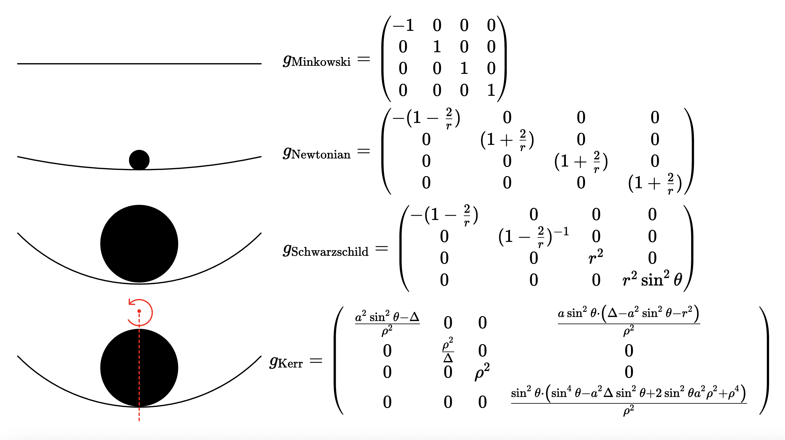

# Newtonian Metric

The goal of this module is to explain the Newtonian Metric which is used as the base model for the Neural Network for Conservative Dynamics. This module should answer the following questions: 

- What is the Newtonian Metric?
- How does it give rise to Newton's Equations of Motion?
- In what limit does the Schwarzschild Metric reduce to the Newtonian Metric?

According to Einstein's Theory of General Relativity, Flat Space is given by the Minkowski Metric: 

$$g=\begin{pmatrix} 
    -1 & 0 & 0 & 0 \\ 
    0 & 1 & 0 & 0 \\ 
    0 & 0 & 1 & 0 \\ 
    0 & 0 & 0 & 1
    \end{pmatrix} \rightarrow ds^2 = -dt^2 + dx^2 + dy^2 + dz^2$$

  The Newtonian Metric is given by
  
  $$g=\begin{pmatrix} 
    -\left(1-\frac{2GM}{r} \right) & 0 & 0 & 0 \\ 
    0 & \left(1+\frac{2GM}{r} \right) & 0 & 0 \\ 
    0 & 0 & \left(1+\frac{2GM}{r} \right) & 0 \\ 
    0 & 0 & 0 & \left(1+\frac{2GM}{r} \right)
    \end{pmatrix}$$

$$ds^2 = -\left(1-\frac{2GM}{r} \right)dt^2 + \left(1+\frac{2GM}{r} \right)(dx^2 + dy^2 + dz^2)$$

  This metric is valid in the limit that $\frac{GM}{r}<<1$. The Newtonian Metric represents a small deviation from flat spacetime due to gravity. Note that we will often use the variable $\phi = -GM/r$ in this module to represent the Newtonian gravitational potential. Please do not confuse this with any sort of angular variable. It is simply the Newtonian gravitational potential, and I'm using it because that is the convention in the book "A First Course in General Relativity" by Bernard Schutz. 
  
  
  
  Observe that for $r>>M$, we see that the Newtonian Metric reduces back to the Minkowski Metric. We will now prove that the Newtonian Metric is so-called because the equations of motion for this metric is, indeed, $F=ma$. We begin by writing down the geodesic equation, which is the equivalent of Newton's law of Inertia in relativity: An object with no external forces acting on it will move in a straight line. The geodesic equation states that the covariant derivative of the velocity vector is 0:
  $$\nabla_{U}U = 0$$
Since $p^{\mu} = mU^{\mu}$, this is equivalent to $\nabla_p p =0$. By expanding the covariant derivative, we obtain: 

$$\frac{dp^{\mu}}{d\tau} + \Gamma^{\mu}_{\alpha \beta}p^{\alpha}p^{\beta}=0$$

Although the derivation of the covariant derivative is a bit involved, we can think of it simply: The covariant derivative is simply a derivative on a curved manifold. If we are in flat space, then the christoffel symbols $\Gamma \sim 0$, so that the covariant derivative and regular derivative are the same: $\nabla_p p = dp/dx^p$. However, the christoffel symbol encodes the degree to which a manifold is curved, and thus adds a correction factor to the derivative. 

$\mu$ is an index which varies from $\mu = 0, 1, 2, 3$, where $\mu=0$ is associated with the time-component of a four-vector and $\mu = 1,2,3$ are associated with the spatial components. Thus, we will consider two cases: $\mu = 0$ (the time component) and $\mu =1,2,3$ (the spatial components). We begin with $\mu=0$: 

$$\frac{dp^0}{d\tau}+\Gamma^0_{\alpha\beta}p^{\alpha}p^{\beta}=0$$

We will now enforce the limit that $v<<c$. We are working in natural units where $c=1$. In the limit that $v<<c$, we have $p^i<<p^0$. Why? Consider the following: $p^{\mu}=m U^{\mu}=m\gamma(1, \vec{v})=(m\gamma, m\vec{v}\gamma)$. Thus:

$$\frac{p^i}{p^0}=\frac{m\vec{v}\gamma}{m\gamma}=v^i << 1 \rightarrow p^i << p^0$$

The $p^0$ component of momentum is the total energy. Why? To see this, we recall that the invariant magnitude of the four-momentum is 

$$p^\mu p_\mu = -m^2 \to -(p^0)^2 + |\vec{p}|^2 = -m^2 \to (p^0)^2 = m^2 + |\vec{p}|^2$$

Comparing this to $E^2=(mc^2)^2 + (pc)^2 \to E^2 = m^2 + |\vec{p}|^2$ (since $c=1$), we immediately make the connection that $E = p^0$.

!!! note "Interpretation of $p^i<<p^0$"
    $p^i=mv^i \gamma$ and $p^0=m\gamma$. The statement that $p^i<<p^0$ simply means that most of the particle's energy is stored in its rest mass energy, not in its motion. In other words, the kinetic energy of the particle is much less than its rest energy. 

Because $p^i << p^0$, we can neglect any terms involving the spatial components of the momentum four-vector. Thus, the geodesic equation reduces from 

$$\frac{dp^0}{d\tau}+\Gamma^0_{\alpha\beta}p^{\alpha}p^{\beta}=0$$

To $\alpha = \beta =0$: 

$$\frac{dp^0}{d\tau}+\Gamma^0_{00}(p^0)^2 =0$$

!!! note "Calculation of Christoffel Symbol $\Gamma^0_{00}$"
    We expand the Christoffel Symbol in terms of the metric as
    
    $$\Gamma^0_{00}=\frac{1}{2}g^{0\alpha}(g_{\alpha 0} + g_{\alpha 0} - g_{00, \alpha})$$
    
    These terms will survive only if $\alpha = 0$, which gives
    
    $$\Gamma^0_{00} = \frac{1}{2}g^{00}(g_{00,0}+g_{00,0}-g_{00,0})=\frac{1}{2}g^{00}g_{00,0}$$
    
    The Newtonian Metric $g_{\mu\nu}$ is given by 
    
    $$g_{\mu\nu}=\begin{pmatrix} -(1+2\phi) & 0 & 0 & 0\\
    0 & (1-2\phi) & 0 & 0 \\
    0 & 0 & (1-2\phi) & 0 \\
    0 & 0 & 0 & (1-2\phi) \\
    \end{pmatrix}$$
    
    Thus, using $g^{00}=-(1+2\phi)^{-1}$ and $g_{00,0}=-2\dot\phi$, the Christoffel symbol reduces to 
    
    $$\Gamma^0_{00} = \frac{1}{2}g^{00}g_{00,0} = \frac{1}{2}\cdot -(1+2\phi)^{-1} \cdot -2\dot\phi = \frac{\dot\phi}{1+2\phi}$$
    
    We're almost there! If we now write this as $\dot\phi(1+2\phi)^{-1}\approx \dot\phi(1-2\phi)\sim \dot\phi-2\phi\dot\phi$, we can neglect the second term because it's of order $O(\phi^2)$, so that ultimately, $\Gamma^0_{00}\sim \dot\phi$. 

Substituting in the christoffel symbol $\Gamma^0_{00}=\dot{\phi}$ and taking $(p^0)^2 = m^2 + |\vec{p}|^2 \sim m^2$ (when $p^i<<p^0$), we obtain 

$$\frac{dp^0}{d\tau}+\dot{\phi} (m^2) = 0 \rightarrow \boxed{\frac{dp^0}{d\tau}=-\dot{\phi}m^2}$$

This is an expression of conservation of energy. In particular, the energy of the system $p^0$ is conserved if the gravitational potential $\phi = -GM/r$ is constant in time. We now consider the spatial components of the geodesic equation: 

$$\frac{dp^i}{d\tau}+\Gamma^i_{\alpha\beta}p^{\alpha\beta}=0$$

By writing $\frac{dp^i}{d\tau}=\frac{dp^i}{dx^\alpha}\frac{dx^{\alpha}}{d\tau}=p^i_\alpha p^\alpha$, we have

$$p^i_{,\alpha}p^{\alpha} + \Gamma^i_{\alpha\beta}p^{\alpha}p^{\beta}=0$$

We again enforce the low-speed approximation that $v<<c$, which means $p^i<<p^0$, so that we can once again discard any terms involving $p^i$:

$$p^i_{,0}p^0 + \Gamma^i_{00}p^0 p^0 =0 \rightarrow p^i_{,0}p^0 + \Gamma^i_{00}(p^0)^2=0$$

Once again using $p^0 \sim m$, we have 

$$m \frac{dp^i}{d\tau} + \Gamma^i_{00}*m^2 = 0$$

We thus have 

$$\frac{dp^i}{d\tau} = -m\Gamma^i_{00}$$

!!! note "Calculation of Christoffel Symbol $\Gamma^i_{00}$"
    We expand the Christoffel Symbol in terms of the metric as
    
    $$\Gamma^i_{00}=\frac{1}{2}g^{i\alpha}(g_{\alpha 0,0}+g_{\alpha 0, 0} - g_{00, \alpha})$$

    These terms are non-zero only in $g^{i\alpha}$ if $\alpha = i$, giving

    $$\Gamma^i_{00}=\frac{1}{2}g^{ii}(g_{i0,0}+g_{i0,0}-g_{00,i})=-\frac{1}{2}g^{ii}g_{00,i}$$

    Now we have $g_{00}=-(1+2\phi) \rightarrow g_{00,i}=-2\phi_{,i}$ and $g^{ii}=(1-2\phi)^{-1}=-\frac{1}{2}(1-2\phi)^{-1}(-2\phi_{,i})$. This becomes $\Gamma^i_{00}=\frac{\phi_{,i}}{1-2\phi}=\phi_{,i}(1-2\phi)^{-1} \approx \phi_{,i}(1+2\phi) \sim \phi_{,i}+O(\phi^2)$. Neglecting all higher-order terms, we end up with $\Gamma^i_{00}\sim \phi_{,i}$.
    
If we now substitute the christoffel symbol $\Gamma^i_{00}=\phi_{,i}$, we get 

$$\frac{dp^i}{d\tau}=-m\Gamma^i_{00}=-m\phi_{,i} \to \frac{dp^i}{d\tau}=-m\frac{d\phi}{dx^i} \to \boxed{\frac{dp^i}{d\tau}=-m\nabla \phi}$$
