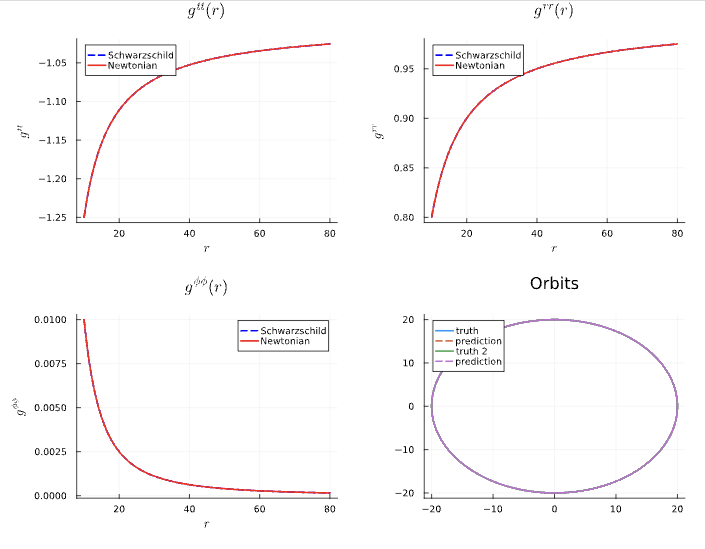
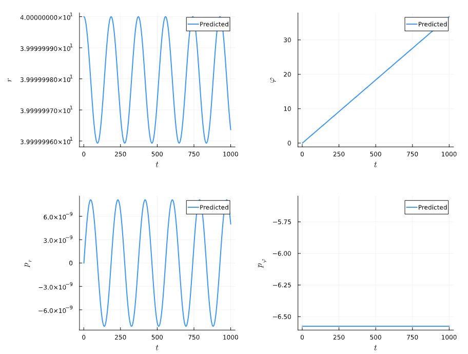
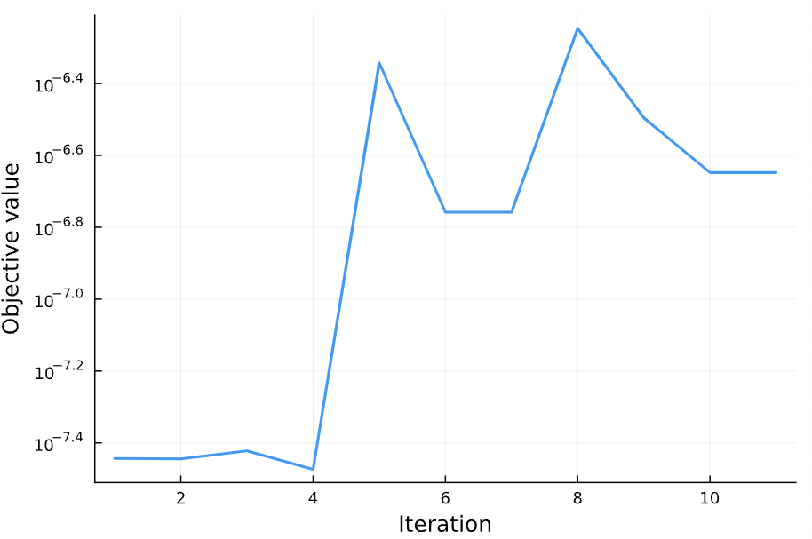

# Sanity Checks

We can run several sanity checks to ensure that our Neural ODE is indeed learning the Schwarzschild Metric. In this module, we examine the following sanity checks: 

!!! note "Use Schwarzchild Metric as Base Model"
    If we use the Schwarzschild Metric as the base model for the Neural ODE, there should be nothing for the network to learn. We are considering training data generated by using schwarzschild geodesics (no dissipation, only conservative dynamics). For this particular sanity check, we consider only circular orbits, the simplest kind of orbit. We can frame this in one of two ways. We can have multiplicative corrections as follows:
    ```julia
    # Base Metric: Schwarzschild Metric
      g = [
            -f^(-1)*f_tt_NN_correction 0 0 0;
            0 f*f_rr_NN_correction 0 0;
            0 0 0 0;
            0 0 0 r^(-2)*f_ϕϕ_NN_correction
        ]
    ```
  In the multiplicative case, the corrections that the neural network should learn is 1. Alternatively, we can have additive corrections as follows:  
    ```julia
    # Base Metric: Schwarzschild Metric
      g = [
            -f^(-1)+f_tt_NN_correction 0 0 0;
            0 f+f_rr_NN_correction 0 0;
            0 0 0 0;
            0 0 0 r^(-2)+f_ϕϕ_NN_correction
        ]
    ```
    The additive corrections should be 0 if the neural network learns "nothing" correctly. Ideally, this sanity check would be the simplest thing for the neural network to do: in the multiplicative correction case, it should learn no more than 1. Likewise in the additive correction case, it should learn simply 0. 

It turns out, quite amazingly, that the neural network fails this sanity check. Let me go step-by-step through the story. 

First of all, when conducting sanity checks, you want to strip the problem of all its complexity. For starters, we make the neural network extremely simple.

```julia
NN_Conservative = Chain(
    Dense(1, 1, tanh), # Input: r only
    Dense(1, 1, tanh),
    Dense(1, 3), # Output: Corrections for [g^tt, g^rr, g^ϕϕ]
)
```

 We will treat the corrections as multiplicative for this first case, as follows: 

```julia
g = [
      -f^(-1)*f_tt_NN_correction 0 0 0;
      0 f*f_rr_NN_correction 0 0;
      0 0 0 0;
      0 0 0 r^(-2)*f_ϕϕ_NN_correction
    ]
```

This Neural Network has only 10 parameters: 

```julia
# Chain(
#    layer_1 = Dense(1 => 1, tanh),      # 2 parameters
#    layer_2 = Dense(1 => 1, tanh),      # 2 parameters
#    layer_3 = Dense(1 => 3),            # 6 parameters
# )        # Total: 10 parameters,
#          #        plus 0 states.
```

We initialize the NN weights and biases for the hidden layers, except for the final layer: 

```julia
for (i, layer) in enumerate(NN_Conservative_params)
    if ~isempty(layer)
        if i == length(NN_Conservative_params)  # Final layer
            layer.weight .= 0
            layer.bias .= 0  # Force output near 0
        else  # Hidden layers
            layer.weight .= 0.1 * randn(rng, eltype(layer.weight), size(layer.weight))
            layer.bias .= 0.1 * randn(rng, eltype(layer.bias), size(layer.bias))
        end
    end
end
```

When we do this, here's what we find for the NN parameters (conservative NN) after initialization (but *before* training): 

- `layer_1 = (weight = [0.23716215388290493;;], bias = [0.12095544082478167])`
- `layer_2 = (weight = [0.03983070751935526;;], bias = [-0.16211640815748582])`
- `layer_3 = (weight = [0.0; 0.0; 0.0;;], bias = [0.0, 0.0, 0.0]))`

When you plot the initial solution to the ODEs, we find exact agreement (as expected, since our base model is the Schwarzschild metric!)


Now when we plot the predicted metrics and orbit after initialization (but **before** training), we find exact agreement, as expected:


Our loss function is simply a mean-squared error between the predicted and true waveform: 

```julia
function loss(NN_params; saveat=tsteps)
    tspan = (saveat[1],saveat[end])
    pred_soln = solve(remake(prob_nn_dual, p = NN_params, tspan=tspan), Tsit5(),
                            saveat = saveat, dt = dt, adaptive=false, verbose = false, sensealg=BacksolveAdjoint(checkpointing=true))
    pred_waveform_real, pred_waveform_imag = compute_waveform(dt_data, pred_soln, mass_ratio)

    loss = ( sum(abs2, waveform_real_ecc .- pred_waveform_real))
    return loss
end
```

When we run our loss function on just the initial solution, we get `2.25e-7`. Now we run the training process, after which we obtain these results: 



I ran through 4 iterations: `optimization_increments = [1, 2, 12, 20]`. Over these four iterations, here's how the weights and biases changed over time: 

!!! warning "Iteration #1 Weights & Biases"
    - `layer_1 = (weight = [0.2371808185363373;], bias = [0.120935736109229])`
    - `layer_2 = (weight = [0.03982656907286769;], bias = [-0.16213122300485072])` 
    - `layer_3 = (weight = [-1.821512530359164e-5; -1.0175274439859679e-5; 8.716160136546225e-7;], bias = [9.8766420116128e-6, 5.723394566465591e-6, 3.481497345221852e-6]))`

!!! warning "Iteration #2 Weights & Biases"
    - `layer_1 = (weight = [0.23718676030213381;], bias = [0.12092385329517617])`
    - `layer_2 = (weight = [0.03983349725191167;], bias = [-0.1621299634300346])`
    - `layer_3 = (weight = [-2.487679834028046e-5; -2.887058705740126e-5; 1.0738885848191339e-6;], bias = [-4.71782709892314e-6, 7.837322991384513e-6, 2.537287450937874e-6]))`

!!! warning "Iteration #12 Weights & Biases"
    - `layer_1 = (weight = [0.2371894925389875;], bias = [0.12093772915528389])`
    - `layer_2 = (weight = [0.03983157793305357;], bias = [-0.16213630211015895])`
    - `layer_3 = (weight = [-1.6052012110502056e-5; -3.96908865801902e-5; -9.619462849749647e-6;], bias = [-2.1939207002792404e-5, 1.500639545614688e-6, -2.168304595713335e-5]))`

!!! warning "Iteration #20 Weights & Biases"
    - `layer_1 = (weight = [0.23718368381374658;], bias = [0.12094224166402442])`
    - `layer_2 = (weight = [0.03983587381877536;], bias = [-0.16213807102352437])`
    - `layer_3 = (weight = [-9.10753409970219e-6; -4.110947128717602e-5; -1.749976849031467e-5;], bias = [-1.7950002563821174e-5, 1.4704911668732934e-5, -1.9016787781020368e-5]))`

Here are the loss function and state variables post-training for the sanity check: 





After printing `f_tt_pred`, `f_rr_pred`, and `f_\phi\phi_pred`, the corrections to the $g^{tt}, g^{rr}, g^{\phi\phi}$, we find: 

```julia
julia> f_tt_pred
400-element Vector{Any}:
 0.9999831633432387
 0.999983162958138
 0.9999831626034161
 0.9999831622767038
 0.9999831619758125
 0.9999831616987213
 0.999983161443564
 ⋮
 0.9999831584900172
 0.9999831584900172
 0.9999831584900172
 0.9999831584900172
 0.9999831584900172
 0.9999831584900172
```

```julia
f_rr_pred
400-element Vector{Any}:
 1.0000197298726115
 1.0000197281342853
 1.0000197265330875
 1.0000197250583238
 1.000019723700115
 1.0000197224493381
 1.0000197212975706
 ⋮
 1.000019707965401
 1.000019707965401
 1.000019707965401
 1.000019707965401
 1.000019707965401
 1.000019707965401
```

```julia
f_pp_pred
400-element Vector{Any}:
 0.9999831223324658
 0.99998312159251
 0.9999831209109258
 0.9999831202831609
 0.9999831197050103
 0.9999831191725903
 0.9999831186823158
 ⋮
 0.9999831130071919
 0.9999831130071919
 0.9999831130071919
 0.9999831130071919
 0.9999831130071919
 0.9999831130071919
```

Thus, the sanity check has been passed for multiplicative corrections for a circular orbit! Now we consider additive corrections!

```julia
# Base Metric: Schwarzschild Metric
g = [
        -f^(-1)+f_tt_NN_correction 0 0 0;
        0 f+f_rr_NN_correction 0 0;
        0 0 0 0;
        0 0 0 r^(-2)+f_ϕϕ_NN_correction
    ]
```


    
