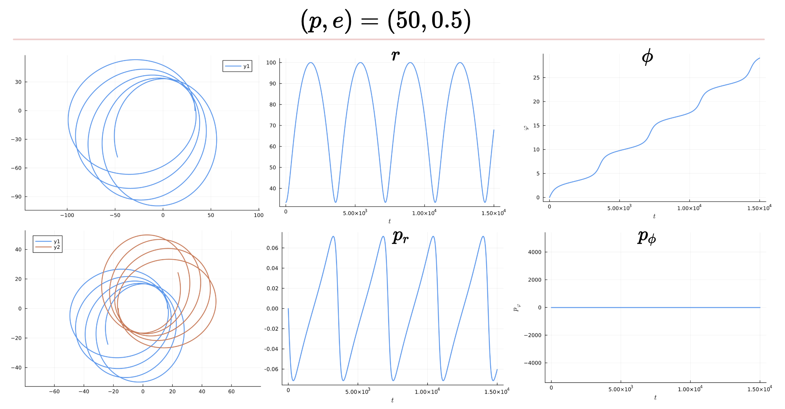

# Schwarzschild Metric

The goal of this module is to generate conservative dynamics training data for the Neural ODE. In particular, this training module will generate the gravitational waveforms associated with two Schwarzschild black holes orbiting each other. These waveforms will subsequently be used as training data for the Neural ODE, which will attempt to reconstruct the orbits. In doing so, the Neural ODE will attempt to learn the Scwhwarzschild Metric from a Newtonian weak-field metric. 

In other words, this module will provide a step-by-step guide to creating a function that has the following input and output: 

!!! note "Generate Schwarzschild Gravitational Waves Function"
    The `Generate_Schwarzschild_GWs()` function will operate as follows: 
    - Goal: Generate training data for conservative dynamics of binary black hole system that will be fed to Neural ODE
    - Input: Mass Ratio $q=m_2/m_1$ & Initial Conditions $\dot{x}(0)$
    - Output: True Orbits $(x_1(t), y_1(t))$ and $(x_2(t), y_2(t))$ of a binary black hole system and the associated gravitational waveform $h(t)$. 

We seek to describe the two body problem in general relativity. In particular, we seek the equations of motion for two body dynamics. In the limit that one black hole is much larger than the other, we can describe the smaller black hole as a particle following geodesics of the Schwarzschild metric around the larger black hole. We now proceed to describe how the two body problem can thus be reduced to an effective one-body problem. 


Consider two black holes of masses $m_1$ and $m_2$ orbiting around their common center-of-mass. We have two cases: 
> - $m_1>>m_2$: The equivalent one-body picture is a particle orbiting a central Schwarzschild black hole of mass $M=m_1+m_2$
> - $m_1\sim m_2:$ The equivalent one-body picture is a given by the Effective One-Body formalism, wherein the two-body dynamics is mapped to a single-body of reduced mass $\mu=m_1m_2 / (m_1+m_2)$ orbiting a central mass $M = m_1+m_2$.

For reasons of simplicity and application to EMRIs, we will focus on the first option above. Our approach will be as follows: to describe the dynamics of the binary black hole system, we will transform to an effective one-body problem as per the $m_1>>m_2$ case above, and then subsequently transform back to the two-body problem. The Hamiltonian describing a particle orbiting a Schwarzschild black hole is 

$$H = \frac{p^2}{2}= \frac{1}{2}p^\mu g_{\mu \nu} p^\nu$$

The Schwarzschild Metric $g_{\mu\nu}$ is 

$$g^{\text{Schwarzschild}}_{\mu\nu} = 
\begin{pmatrix}
    -\left(1-\frac{2M}{r} \right) & 0 & 0 & 0 \\
    0 & \left(1-\frac{2M}{r} \right)^{-1} & 0 & 0 \\ 
    0  & 0 & r^2 & 0 \\ 
    0 & 0 & 0 & r^2 \sin^2 \theta
\end{pmatrix}$$

Thus, the Hamiltonian for the Schwarzschild Metric is 

$$H_{Schwarzschild}=- \left(1-\frac{2M}{r}\right)^{-1}\frac{p_t^2}{2} + \left(1-\frac{2M}{r}\right) \frac{p_r^2}{2} + \frac{p_\phi^2}{2r^2}$$

$$H=\frac{1}{2}\left(p_t, p_r, p_\theta, p_\phi \right)^T \begin{pmatrix}
    -\left(1-\frac{2M}{r}\right)^{-1} & 0 & 0 & 0\\
    0 & \left(1-\frac{2M}{r}\right) & 0 & 0 \\ 
    0 & 0 & 0 & 0 \\
    0 & 0 & 0 & r^{-2}
    \end{pmatrix}	 
    \left(p_t, p_r, p_\theta, p_\phi \right)$$

We formulate this in Julia as follows: 
```julia
function H(state_vec)
        t, r, θ, φ, p_t, p_r, p_θ, p_ϕ = state_vec

        f = (1 - (2/r))
        p = [p_t, p_r, p_θ, p_ϕ]
        g = [
                -f^(-1) 0 0 0;
                0 f 0 0;
                0 0 0 0;
                0 0 0 r^(-2)
            ]

        H_schwarzschild = (1/2) * p' * g * p

        return H_schwarzschild # Returns equations of motion in _proper_ time
    end
```

We can now use Hamilton's Equations of Motion to obtain the orbit: 

$$\dot{q}=\frac{\partial H}{\partial p}, -\dot{p}=\frac{\partial H}{\partial q}$$

Thus, for a particle on an equatorial orbit around a Schwarzschild black hole, we obtain the following geodesic equations of motion: 

$$\frac{dt}{d\tau} = \left(1-\frac{2M}{r}\right)^{-1}E, \frac{dr}{d\tau} = \left(1-\frac{2M}{r}\right){p_r}, \frac{d\theta}{d\tau} =0, \frac{d\phi}{d\tau} = \frac{L}{r^2}$$

Similarly, the momentum vector $p^{\mu}$ evolves as

$$\frac{dp_t}{d\tau} = \dot E = 0$$ 
$$\frac{dp_r}{d\tau} =  -\frac{1}{2}\left[\left(1-\frac{2M}{r}\right)^{-2}\left( \frac{2M}{r^2}\right) (p_t)^2 + \frac{2M}{r^2}(p_r)^2-2r^{-3} (p_{\phi})^2\right]$$
$$\dot p_\theta = 0, \dot p_\phi = \dot L = 0$$

We have thus obtained all the equations of motion for a test particle orbiting a Schwarzschild Black Hole. In Julia, this is simply: 

```julia
grad_H = ForwardDiff.gradient(H, x)

L = [
        zeros(4, 4) I(4);
        -I(4) zeros(4, 4)
    ]

Conservative = L * grad_H
```

In General Relativity, there are two kinds of time: the proper time and coordinate time. There remains a subtle step: Our trajectories are parametrized in terms of proper time $\tau$. To convert back to coordinate time, which is the time measured by a detector here on Earth, we must multiply the equations of motion by a conversion factor. For instance:

$$\frac{dr}{dt}=\frac{dr}{d\tau}\frac{d\tau}{dt}=\frac{dr}{d\tau}\left(\frac{dt}{d\tau}\right)^{-1}=\frac{dr}{d\tau}\left(\frac{\partial H}{\partial p_t}\right)^{-1}$$

In Julia, we formulate this as: 
```julia
dx_dτ = Conservative

dH_dpₜ = grad_H[5]
dτ_dt = (dH_dpₜ)^(-1)

for i = 1:8
    dx[i] = dx_dτ[i] * dτ_dt
end
```

Now that we have all the equations of motion, we return them as an output of the `GENERIC()` function:

```julia
function GENERIC(du, u, model_params, t;
                              NN=nothing, NN_params=nothing)
    x = u[1:8]
    q = mass_ratio
    M = 1.0

    function H(state_vec)
        # Returns Schwarzschild Hamiltonian
        H_schwarzschild = (1/2) * p' * g * p
        return H_schwarzschild
    end

    # ... [Use Hamilton Equations to get equations of motion]

    # Return equations of motion
    return [du[1], du[2], du[3], du[4], du[5], du[6], du[7], du[8]]
end
```

Now that we have the `GENERIC()` function, we extract the ODEs from it: 
```julia
function ODE_model_dual(du, u, p, t)
    du = GENERIC(du, u, model_params, t)
    return du
end
```

Now we define the ODE problem, solve it, and convert it to a waveform!
```julia
prob = ODEProblem(ODE_model_dual, u0, tspan)
soln = Array(solve(prob, Tsit5(), saveat = tsteps, dt = dt, adaptive=false, verbose=false))
gw = compute_waveform(soln)
```

How do we actually visualize the orbits? We can plot the effective one-body orbit via 
```julia
orbit = soln2orbit(soln)
plot(orbit[1,:], orbit[2,:], aspect_ratio=:equal)
```

`soln2orbit()` is simply a function which extracts the $(r,\phi)$ components of the state vector solution and converts them to $(x,y)$: 
```julia
function soln2orbit(soln, model_params=nothing)
    #=
        Performs change of variables:
        (r(t),ϕ(t)) ↦ (x(t),y(t))
    =#

    r = soln[2,:] # radial coordinate solutions
    ϕ = soln[4,:] # planar angle solutions

    x = r .* cos.(ϕ)
    y = r .* sin.(ϕ)

    orbit = [x'; y']
    return orbit
end
```

To visualize the actual, original 2-body problem of the two binary black holes, we use the `one2two()` function, which implements the following transformation to go from the state vector of the effective one body problem $r(t)$ to the state vectors of the two body problem: 
$$M = m_1 + m_2, r_1 = \frac{m_2}{M} * \text{path}, r_2 = -\frac{m_1}{M} * \text{path}$$

Why is it that $r_1 \propto m_2$ and vice-versa? This can be easily understood: In the limiting case that $m_2>>m_1, q=1, M\sim m_2$. Thus, $r_1 \sim 1*\text{path}, r_2 \sim 0$. This is reasonable, as the second mass has negligible motion if its much more massive than the first mass. In Julia, this becomes:
```julia
function one2two(path, m1, m2)
    #=
        We need a very crude 2-body path

        Assume the 1-body motion is a newtonian 2-body position vector r = r1 - r2
        and use Newtonian formulas to get r1, r2
        (e.g. Theoretical Mechanics of Particles and Continua 4.3)
    =#

    M = m1 + m2
    r1 = m2/M .* path
    r2 = -m1/M .* path

    return r1, r2
end
```

Finally, if we'd like to obtain the gravitational wave from the two-body dynamics instead of the effective one-body dynamics (a good sanity check that they result in the same $h(t)$), we can employ: 
```julia
h_plus_true, h_cross_true = h_22_strain_two_body(dt_data, blackHole_r1, mass1, blackHole_r2, mass2)
```

That's it! We're done! We've generated the orbits and waveforms associated with the Schwarzschild Metric!


