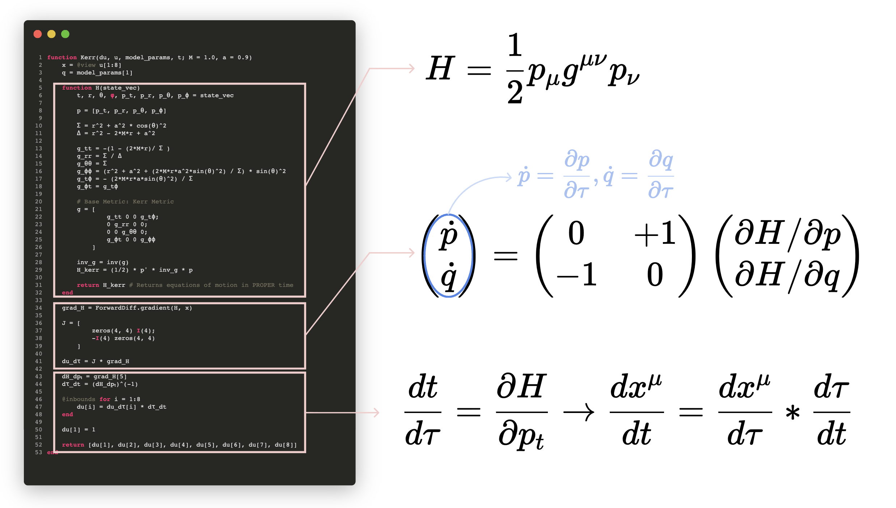

# Numerical Kludge Scheme

To calculate the gravitational waveform for a Kerr geodesic, we need a function which can: 

```julia
function Compute_Gravitational_Wave(Geodesic, Observer)
    return h+, hx
end
```

As a first check, we must ensure that we are in the correct temporal coordinates. For Kerr geodesics, there are not one, not two, but three possible temporal variables!: Proper Time, Coordinate Time, and Mino Time. 

To ensure that we are in Coordinate Time, we return to our geodesic equations of motion, which are calculated in the `Kerr()` function: 

```julia
function Kerr(du, u, model_params, t; M = 1.0, a = 0.9)
    x = @view u[1:8]
    q = model_params[1]

    function H(state_vec)
        t, r, θ, φ, p_t, p_r, p_θ, p_ϕ = state_vec

        p = [p_t, p_r, p_θ, p_ϕ]

        Σ = r^2 + a^2 * cos(θ)^2
        Δ = r^2 - 2*M*r + a^2

        g_tt = -(1 - (2*M*r)/ Σ )
        g_rr = Σ / Δ
        g_θθ = Σ
        g_ϕϕ = (r^2 + a^2 + (2*M*r*a^2*sin(θ)^2) / Σ) * sin(θ)^2
        g_tϕ = - (2*M*r*a*sin(θ)^2) / Σ
        g_ϕt = g_tϕ

        # Base Metric: Kerr Metric
        g = [
                g_tt 0 0 g_tϕ;
                0 g_rr 0 0;
                0 0 g_θθ 0;
                g_ϕt 0 0 g_ϕϕ
            ]

        inv_g = inv(g)
        H_kerr = (1/2) * p' * inv_g * p

        return H_kerr # Returns equations of motion in PROPER time
    end

    grad_H = ForwardDiff.gradient(H, x)

    J = [
            zeros(4, 4) I(4);
            -I(4) zeros(4, 4)
        ]

    Conservative = J * grad_H
    
    du_dτ = Conservative

    dH_dpₜ = grad_H[5]
    dτ_dt = (dH_dpₜ)^(-1)

    @inbounds for i = 1:8
        du[i] = du_dτ[i] * dτ_dt
    end

    du[1] = 1

    return [du[1], du[2], du[3], du[4], du[5], du[6], du[7], du[8]]
end
```

This can be a lot to look at at first sight, so here's a diagram summarizing the main components of this function, which returns 8 equations of motion for Kerr geodesics: 



The essential idea is as follows: First, we form the hamiltonian via 

$$H = \frac{1}{2}p_{\mu}g^{\mu\nu}p_{\nu}$$

Then, we can use Hamilton's equations of motion:

$$\dot q = \frac{\partial H}{\partial p}, \dot p = - \frac{\partial H}{\partial q}$$

If we write this in matrix form, it looks like: 

$$\begin{pmatrix}
\dot p \\ 
\dot q
\end{pmatrix} = \begin{pmatrix}
0 & +1 \\ 
-1 & 0
\end{pmatrix}
\begin{pmatrix}
\partial H/\partial p \\ 
\partial H/\partial q
\end{pmatrix}$$

Canonically, these time derivates are in terms of proper time: 

$$\dot p = \frac{\partial p}{\partial \tau},\dot q = \frac{\partial q}{\partial \tau}$$

To convert these to coordinate time, we use the chain rule: 

$$\dot t = \frac{\partial H}{\partial p_t}$$

That means 

$$\dot t = \frac{dt}{d\tau} = \frac{\partial H}{\partial p_t}$$

Thus, in terms of coordinate time, the equations of motion are: 

$$\frac{dx^{\mu}}{dt}=\frac{dx^{\mu}}{d\tau}*\frac{d\tau}{dt}$$

Great! With this in order, we turn to the orbit-to-waveform mapping. We will employ the so-called "Numerical Kludge" formalism, which uses the Quadrupole approximation (in the original paper, the Quadrupole-Octope approximation or Press formula are also tested).

```julia
function Compute_Gravitational_Wave(Geodesic, Observer)
    return h+, hx
end
```
To implement this formalism, we have the following steps: 

* Boyer-Lindquist to Cartesian Coordinates

  - Convert the Kerr geodesic from $(r, \theta, \phi)$ to $(x, y, z)$ coordinates. There are technically two ways to convert: a oblate-spheroidal transformation and a spherical-coordinates transformation. In the original NK paper, a simple spherical coordinate transformation is used, which is why we opt for the latter.

```julia
function BoyerLindquist_to_Cartesian(r, θ, ϕ; a)
    x = @. r * sin(θ) * cos(ϕ)
    y = @. r * sin(θ) * sin(ϕ)
    z = @. r * cos(θ)
    return x, y, z
end 

function Soln_to_Source(soln; a)
    t = soln[1, :]
    r = soln[2, :]
    θ = soln[3, :]
    ϕ = soln[4, :]

    x, y, z = BoyerLindquist_to_Cartesian(r, θ, ϕ; a = a)
    orbit = [x'; y'; z']

    return t, orbit
end
```

* Calculate Quadrupole Tensor 

  - The Quadrupole Tensor is calculated as $Q = \mu \left(x_i x_j - \frac{1}{3}\delta_{ij} * r^2 \right)$

```julia
function Calculate_Quadrupole_Tensor(orbit; μ = 1.0)
    N = size(orbit, 2)
    Q = zeros(3, 3, N)

    for k in 1:N 
        x = orbit[:, k]
        r2 = dot(x, x)

        for i in 1:3, j in 1:3 
            δij = (i == j) ? 1.0 : 0.0
            Q[i, j, k] = μ * (x[i] * x[j] - (1/3)*δij*r2)
        end
    end

    return Q
end
```
 
* Take Second Derivative of Quadrupole Tensor  

  - A second derivative stencil was implemented by Prof. Keith from the paper "Generation of finite difference formulas on arbitrarily spaced grids"

```julia
function Calculate_Q_ddot(Q, dt)
    Qdd = similar(Q)

    for i in 1:3, j in 1:3
        Qdd[i, j, :] .= d2_dt2(vec(Q[i, j, :]), dt)
    end

    return Qdd 
end
```
 
* Project to Observer

  - We define a unit vector from the center of the central massive black hole to the observer. On the observer plane, polarization bases vectors $\hat p$ and $\hat q$ are defined such that $\hat p \perpto \hat q \perpto \hat n$

```julia
function Observer_Basis(θ_obs, ϕ_obs)
    
    # Direction to observer
    n = [
        sin(θ_obs) * cos(ϕ_obs),
        sin(θ_obs) * sin(ϕ_obs),
        cos(θ_obs)
    ]

    # Polarization basis vectors (p,q) on observer sky
    p = [
        cos(θ_obs) * cos(ϕ_obs),
        cos(θ_obs) * sin(ϕ_obs),
        -sin(θ_obs)
    ]

    q = [
        -sin(ϕ_obs),
        cos(ϕ_obs),
        0.0
    ]

    return n, p, q
end
```
 
* Compute $h_+$ and $h_\times$ 

  - We compute $h_+$ in terms of the polarization bases vectors as $h_+ = (p_i * p_j - q_i * q_j) * H_{ij}$
  - We compute $h_\times$ in terms of the polarization bases vectors as $h_\times = (p_i * q_j + q_i * p_j) * H_{ij}$

```julia
function Compute_h₊_hₓ(Qdd; θ_obs = 0.0, ϕ_obs = 0.0, D = 1.0)
    _, p, q = Observer_Basis(θ_obs, ϕ_obs)
    N = size(Qdd, 3)
    
    h₊ = zeros(N)
    hₓ = zeros(N)

    for k in 1:N
        H = (2/D) .* Qdd[:, :, k]

        h₊[k] = sum(
            (p[i] * p[j] - q[i] * q[j]) * H[i, j]
            for i in 1:3, j in 1:3
        )

        hₓ[k] = sum(
            (p[i] * q[j] + q[i] * p[j]) * H[i, j]
            for i in 1:3, j in 1:3
        )
    end

    return h₊, hₓ
end
```

To summarize, we implement everything in a single small function `nk_quadrupole_waveform`, which takes as input our geodesic `soln`, the spin of the central black hole `a`, the mass of the smaller black hole `μ = 1.0`, and the location of the observer `θ_obs = 0.0, ϕ_obs = 0.0, D = 1.0`:

```julia
function nk_quadrupole_waveform(soln; a, μ = 1.0, θ_obs = 0.0, ϕ_obs = 0.0, D = 1.0)
    
    t, orbit = Soln_to_Source(soln; a = a)
    dt = assert_uniform_time(t)
    Q = Calculate_Quadrupole_Tensor(orbit; μ = μ)
    Q̇̇ = Calculate_Q_ddot(Q, dt)
    h₊, hₓ = Compute_h₊_hₓ(Q̇̇; θ_obs = θ_obs, ϕ_obs = ϕ_obs, D = D)

    return t, h₊, hₓ, Q, Q̇̇
end 
```

In practice, we use this function simply as follows: 

```julia
t, h₊, hₓ, Q, Qdd = nk_quadrupole_waveform(true_solution; a = 0.9, μ = 1.0, θ_obs = 0.0, ϕ_obs = 0.0, D = 1.0)
```

It's worth running a few sanity checks to ensure our waveform generation scheme makes sense: 

1. Quadrupole Tensor is STF: Symmetric & Trace-Free
2. Face-On Projection Check ($\theta_{obs}=0, \phi_{obs}=0$)
3. Circular, Equatorial Orbit Gravitational Waveform
4. Periapsis Radiation Burst Check
5. Varying Observer Inclination for Circular, Equatorial Orbit

What is the first check about? The Quadrupole Tensor is defined as: 

$$Q_{ij} = I_{ij} - \frac{1}{3}\delta_{ij}I_{kk}$$

where $I_{kk} = I_{xx} + I_{yy} + I_{zz}$ is the trace and $\delta_{ij}$ turns on the trace subtraction only for diagonal entries: 

$$
\begin{pmatrix}
I_{xx} - \frac{1}{3}(I_{xx} + I_{yy} + I_{zz}) & I_{xy} & I_{xz} \\
I_{yx} & I_{yy} - \frac{1}{3}(I_{xx} + I_{yy} + I_{zz}) & I_{yz} \\ 
I_{zx} & I_{yy} & I_{zz} - \frac{1}{3}(I_{xx} + I_{yy} + I_{zz}) \\
\end{pmatrix}
$$

To check that the Quadrupole and its second derivative is STF, we do:

!!! details "Quadrupole Tensor Sanity Checks"
    To calculate the trace, we simply take: 
    ```math 
    tr[Q] = Q_{xx}+Q_{yy}+Q_{zz}
    ```
    In practice, of course, there will be not one quadrupole tensor, but -- if you have, say, 5000 time steps -- _5000_ quadrupole tensors, each evaluated at a given time step: 
    ```math
    tr[Q(t_i)] = Q_{xx}(t_i)+Q_{yy}(t_i)+Q_{zz}(t_i)
    ```
    $Q$, the quadrupole tensor, is usually a 3x3 matrix. We keep track of the $k$-th timestep of $Q$ via `Q[i,j,k]` where `i,j` run over the $x,y,z$ coordinates, and $k$ runs from 1 to 5000 (because there are 5000 time steps from $t_i$ to $t_f$ in the simulation). The method `size(Q,3)` returns the size of the 3rd dimension of the tensor $Q$, which in this case is 5000. In general, the `size(A,i)` method returns the size of the $i$-th dimension of the tensor $A$. 
    ```math
    trQ   = [Q[1,1,k] + Q[2,2,k] + Q[3,3,k] for k in 1:N]`
    ```
    Thus, the trace of the quadrupole tensor is calculated as `trQ = [Q[1,1,k] + Q[2,2,k] + Q[3,3,k] for k in 1:N]`. To check that the tensor is symmetric, the `permutedims()` method is used, which calculates the transpose of a matrix. For instance, `permutedims(A, (2,1))` flips the 2nd and 1st axes of the $A$ tensor (exchanges the rows and columns) to give the transpose. In the case below, we employ `permutedims(Q, (2,1,3))` to swap the rows and columns of $Q$ whilst keeping the 3rd axes intact. 
    ```julia
    function tensor_sanity_checks(Q, Qdd)
        N = size(Q, 3)
    
        trQ   = [Q[1,1,k] + Q[2,2,k] + Q[3,3,k] for k in 1:N]
        trQdd = [Qdd[1,1,k] + Qdd[2,2,k] + Qdd[3,3,k] for k in 1:N]
    
        symQ   = maximum(abs.(Q .- permutedims(Q, (2,1,3))))
        symQdd = maximum(abs.(Qdd .- permutedims(Qdd, (2,1,3))))
    
        println("max |tr(Q)|   = ", maximum(abs.(trQ)))
        println("max |tr(Qdd)| = ", maximum(abs.(trQdd)))
        println("max |Q-Qᵀ|    = ", symQ)
        println("max |Qdd-Qddᵀ|= ", symQdd)
    end
    ```

For our next sanity check, we would like to ensure that the gravitational waveform reproduces a known equation: 

!!! details "Z-Axis Observer Radiation"
    For an observer on the z-axis, we have the following observer frame: 
    ```math 
    \hat p = (1,0,0), \hat q = (0, 1, 0), \hat n = (0, 0, 1)
    ```
    Employing the relation:
    ```math
    h_+ = \Sigma_{i=1}^{3} \Sigma_{j=1}^{3} (p_i p_j - q_i q_j) * h_{ij}
    ```
    We can expand this as follows: 
    ```math
    h_+ = (p_x p_x - q_x q_x) h_{xx} + (p_x p_y - q_x q_y) h_{xy} + (p_x p_z - q_x q_z) h_{xz}
        + (p_y p_x - q_y q_x) h_{yx} + (p_y p_y - q_y q_y) h_{yy} + (p_y p_z - q_y q_z) h_{yz}
        + (q_z p_x - q_z q_x) h_{zx} + (p_z p_y - q_z q_y) h_{zy} + (p_z p_z - q_z q_z) h_{zz}
    ```
    Clearly, neither $p$ nor $q$ has a $z$-component, so there will be no radiation detected in the z-direction, and we find (after plugging in that $p_x = 1$ and $q_y = 1$) that 
    ```math
    h_+ = h_{xx} - h_{yy}
    ```
    Similarly, the $h_\times$ radiation is given by 
    ```math
    h_\times = (p_i q_j + q_i p_j)h_{ij}
    ```
    Think about why only $h_{xy}$ components survive here: Because either $p_i$ or $q_i$ will be 0 for either only $x$ or $y$ components: 
    ```math
    (p_x q_x + q_x p_x) h_{xx} = 0, (p_y q_y + q_y p_y) h_{yy} = 0
    ```
    Thus, only mixed components would survive, so it turns out
    ```math
    h_{\times} = h_{xy} + h_{yx}
    ```
    Since the tensor $h_{xy} = h_{yx}$ is symmetric, that gives
    ```math
    h_{\times} = 2h_{xy}
    ```
    Thus, not withstanding constant factors, we obtain: 
    ```math
    h_+ = (1/D)*(\ddot Q_{xx} - \ddot Q_{yy})
    ```
    Likewise, we obtain
    ```math
    h_\times = (2/D)*(\ddot Q_{xy})
    ```

cxv
